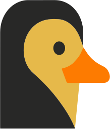
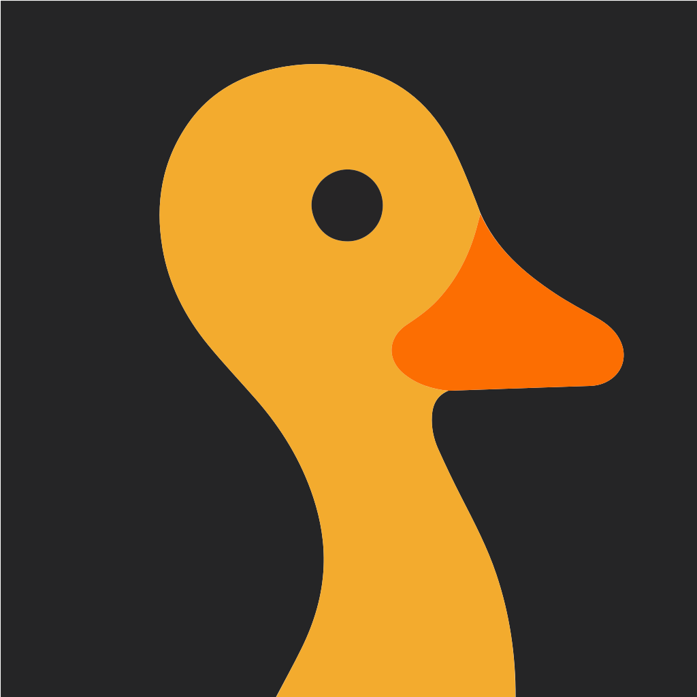

# Kwak Brand Kit

Logos, colors, and type for [Kwak](https://kwak.io). If you're writing about us, building an integration, or putting our mark on something, grab assets from here.

## Logos

Primary logo. Use on the web, in product, in headers, in docs.

<p>
  
</p>

| File | Use |
| --- | --- |
| [`kwak-logo.svg`](logos/kwak-logo.svg) | Vector. Preferred for web and print. |
| [`kwak-logo-2048.png`](logos/kwak-logo-2048.png) | 2048w PNG. Slide decks, large hero exports. |
| [`kwak-logo-1024.png`](logos/kwak-logo-1024.png) | 1024w PNG. General-purpose raster. |
| [`kwak-logo-512.png`](logos/kwak-logo-512.png) | 512w PNG. |
| [`kwak-logo-256.png`](logos/kwak-logo-256.png) | 256w PNG. Small UI uses. |

Square mark. Use for social avatars, app icons, favicons, and anywhere a square or circular crop is required.

<p>
  
</p>

| File | Use |
| --- | --- |
| [`kwak-mark-square.svg`](logos/kwak-mark-square.svg) | Vector. Preferred. |
| [`kwak-mark-square-1024.png`](logos/kwak-mark-square-1024.png) | 1024×1024. Social avatars (X, GitHub, LinkedIn). |
| [`kwak-mark-square-512.png`](logos/kwak-mark-square-512.png) | 512×512. App icons, OG images. |
| [`kwak-mark-square-256.png`](logos/kwak-mark-square-256.png) | 256×256. |
| [`kwak-mark-square-128.png`](logos/kwak-mark-square-128.png) | 128×128. |
| [`kwak-mark-square-64.png`](logos/kwak-mark-square-64.png) | 64×64. Favicons. |
| [`kwak-mark-square-32.png`](logos/kwak-mark-square-32.png) | 32×32. Browser tab favicon. |

### Usage

- Keep clear space around the mark equal to roughly the height of the duck's eye.
- Don't recolor, skew, or add effects to the marks.
- On dark backgrounds, the existing logo works as-is. On light backgrounds the duck still reads correctly because the silhouette is gold and dark grey.

## Colors

Our palette is a warm dark paper with cream ink and a single gold accent.

| Token | Hex | Swatch | Use |
| --- | --- | --- | --- |
| `paper` | `#0F0C08` |  | Primary background |
| `paper2` | `#16130E` |  | Slightly raised surfaces |
| `ink` | `#F1E9D7` |  | Primary text |
| `ink2` | `#CFC6B0` |  | Secondary text / body prose |
| `muted` | `#8A7F6D` |  | Labels, eyebrows, metadata |
| `muted2` | `#5E5646` |  | Disabled, placeholders, low-emphasis |
| `gold` | `#E6B94A` |  | Accent. Use sparingly, e.g. the "Kwak" wordmark, key highlights |
| `line` | `rgba(241, 233, 215, 0.11)` | | Hairline dividers on dark surfaces |

### CSS variables

```css
:root {
  --paper:   #0F0C08;
  --paper-2: #16130E;
  --ink:     #F1E9D7;
  --ink-2:   #CFC6B0;
  --muted:   #8A7F6D;
  --muted-2: #5E5646;
  --gold:    #E6B94A;
  --line:    rgba(241, 233, 215, 0.11);
}
```

### Tailwind

```ts
colors: {
  paper:   "#0F0C08",
  paper2:  "#16130E",
  ink:     "#F1E9D7",
  ink2:    "#CFC6B0",
  muted:   "#8A7F6D",
  muted2:  "#5E5646",
  gold:    "#E6B94A",
}
```

## Typography

| Role | Family | Source |
| --- | --- | --- |
| Display / headings | **Young Serif** | [Google Fonts](https://fonts.google.com/specimen/Young+Serif) |
| Body / UI | **Hanken Grotesk** | [Google Fonts](https://fonts.google.com/specimen/Hanken+Grotesk) |
| Fallbacks (display) | Georgia, serif | |
| Fallbacks (body) | system-ui, -apple-system, sans-serif | |

### Web embed

```html
<link
  href="https://fonts.googleapis.com/css2?family=Hanken+Grotesk:ital,wght@0,100..900;1,100..900&family=Young+Serif&display=swap"
  rel="stylesheet"
/>
```

### Font stack

```css
font-family: "Hanken Grotesk", system-ui, -apple-system, sans-serif;
/* display */
font-family: "Young Serif", Georgia, serif;
letter-spacing: -0.015em;
```

## Voice

Short. Specific. Confident without bluster. We say what we build, name who we built it for, and stop there. No em dashes; use colons, periods, or parens.

## Contact

- Web: [kwak.io](https://kwak.io)
- Email: [contact@kwak.io](mailto:contact@kwak.io)
- X: [x.com/kwak_labs](https://x.com/kwak_labs)
- GitHub: [github.com/kwak-labs](https://github.com/kwak-labs)
